# Trial Conversion Analysis
### Why Do Only 1 in 5 Trial Companies Convert?

**Author:** Adediran Adeyemi
**Website:** [www.adediranadeyemi.com](https://www.adediranadeyemi.com)

---

## Table of Contents

1. [Executive Summary](#executive-summary)
2. [Business Context](#business-context)
3. [The Central Question](#the-central-question)
4. [Data Overview](#data-overview)
5. [Methodology and Analytical Approach](#methodology-and-analytical-approach)
6. [The Admin vs Worker Framework](#the-admin-vs-worker-framework)
7. [Key Findings](#key-findings)
8. [Statistical Analysis and Predictive Modelling](#statistical-analysis-and-predictive-modelling)
9. [SQL Data Models](#sql-data-models)
10. [Recommendations](#recommendations)
11. [Limitations and Honest Caveats](#limitations-and-honest-caveats)
12. [Setup and Usage](#setup-and-usage)

---

## Executive Summary

This project analyses trial-to-paid conversion behaviour across **966 trialling organisations** of a B2B workforce scheduling platform. Over 102,895 product events were analysed across a 30-day trial window.

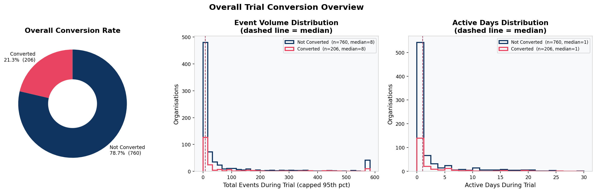

The chart above immediately surfaces the scale of the problem. The overall conversion rate is **21.3%**, meaning 760 out of 966 trialling organisations did not pay. Event volume and active days look nearly identical between converters and non-converters, which is the first sign that in-app behaviour alone will not explain who converts.

The analytical framework built here is grounded in a structural observation about this product: it serves two fundamentally different users, admins and workers, and treating all activity as equivalent masks that distinction entirely. Splitting events by actor type reveals that **51% of trialling organisations never got a single employee onto the platform** after the admin set it up. The product was configured for a workforce that never used it.

Three concrete, immediately executable recommendations emerge from the full analysis:
- Capture company size, industry, and acquisition source at signup
- Trigger an automated worker onboarding nudge 48 hours after shift creation with zero worker activity
- Deploy proactive CS outreach between Days 14 and 21 of the trial, before deadline urgency sets in

---

## Business Context

This is a B2B SaaS product for workforce scheduling. Businesses use it to build rotas, manage shift assignments, handle time and attendance, process absence requests, and export payroll. It serves two fundamentally different users within the same account.

**Admins** are managers or business owners. They set up the schedule, create shifts, approve timesheets, and manage the team. They are typically the ones who sign up for the trial and make the purchasing decision.

**Workers** are the employees. They view their schedule on mobile, clock in and out, set their availability, and request swaps or handovers. They do not make the purchasing decision, but they are the ones whose daily work lives depend on the product.

This distinction matters enormously for understanding product adoption, churn risk, and conversion. An analysis that treats all events as equivalent misses the fact that admin activity and worker activity tell very different stories about how deeply a product has been embedded in a business.

The motivation for building this analysis around that admin/worker distinction came directly from the data. An initial pass treating all events equally found that converters and non-converters looked essentially the same across every metric. That result prompted the question: are we measuring the right users? The answer shaped the entire analytical framework.

---

## The Central Question

> **What does a company do during its trial that predicts whether it will pay?**

The assumption going in was that companies that engage more deeply with the product, use more features, stay active for more days, and get more employees onto the platform should be more likely to convert. This is the standard product-led growth hypothesis.

This analysis tests that hypothesis rigorously across multiple dimensions, including splitting activity by user type, measuring worker engagement depth, modelling time-to-adoption, and training three separate machine learning models. The answer challenges the hypothesis at every level and the insight that falls out of that challenge is more useful than a simple confirmation would have been.

---

## Data Overview

| Field | Type | Description |
|-------|------|-------------|
| `organization_id` | string | Unique identifier for each trialling organisation |
| `activity_name` | string | Name of the product activity performed |
| `timestamp` | datetime | When the activity occurred |
| `converted` | boolean | Whether the organisation converted to paid |
| `converted_at` | datetime | Timestamp of conversion (null if not converted) |
| `trial_start` | datetime | When the trial started |
| `trial_end` | datetime | Trial expiry date (trial_start + 30 days) |

**Dataset dimensions after cleaning:**

| Metric | Value |
|--------|-------|
| Raw rows | 170,526 |
| Rows after deduplication | 102,895 |
| Duplicate rows removed | 67,631 (40%) |
| Unique organisations | 966 |
| Unique activity types | 28 |
| Overall conversion rate | 21.3% |
| Converted organisations | 206 |
| Non-converted organisations | 760 |

**Data quality steps applied:**
- Exact deduplication across all 7 columns removed 67,631 rows (40% of raw data)
- All datetime columns parsed with error coercion; no invalid timestamps found after cleaning
- Zero events found outside the trial window (before `trial_start` or after `trial_end`)
- Negative time-to-first-activity values clipped to zero

---

## Methodology and Analytical Approach

The analysis was structured in four layers.

**Layer 0: Data Cleaning**

Before any analysis, the raw dataset was cleaned and validated. The 170,526 raw rows were deduplicated by performing exact matching across all 7 columns, removing 67,631 duplicate rows (40% of the raw data). All datetime columns (`timestamp`, `converted_at`, `trial_start`, `trial_end`) were parsed using error coercion so that malformed values became null rather than causing failures. The `converted_at` field was treated carefully since it is legitimately null for non-converting organisations and not a data quality issue. Events were then validated against the trial window, confirming zero events fell before `trial_start` or after `trial_end`. Finally, computed time fields such as hours to first activity were clipped at zero to prevent negative values arising from sub-second timestamp precision.

**Layer 1: Baseline Feature Engineering**

All 966 organisations were characterised on a set of org-level metrics: total event count, admin event count, worker event count, unique activity types used, active days (admin-side and worker-side separately), and binary flags for specific worker activities (punch clock, availability setting, shift swaps, absence requests, mobile schedule view). A worker engagement depth score (0 to 5) was constructed by summing the binary worker activity flags.

**Layer 2: Admin vs Worker Segmentation**

All 28 activity types were manually classified as either admin actions or worker actions based on product logic. Admin actions are configuration and management tasks performed by managers. Worker actions are operational daily-life tasks performed by employees. Each organisation was then classified into one of three archetypes: both admin and workers active, admin only with workers never joining, and minimal or no engagement. The time gap between first admin action and first worker action was measured as the handoff gap.

**Layer 3: Statistical Testing and Predictive Modelling**

Mann-Whitney U tests compared continuous metrics between converters and non-converters. Chi-square tests assessed the relationship between each binary worker activity flag and conversion. Three Random Forest models were trained and evaluated using 5-fold cross-validated ROC-AUC, one using admin features only, one using worker features only, and one using both combined. Kaplan-Meier survival analysis was applied to model time-to-conversion for worker-active versus admin-only organisations.

---

## The Admin vs Worker Framework

The most important analytical decision in this project was to separate admin and worker activity rather than treating all events as equivalent. The rationale is grounded in how the product actually works.

Admin actions (creating shifts, approving timesheets, applying templates) are configuration tasks. They tell us the admin has used the product for its intended purpose. Worker actions (clocking in, viewing the mobile schedule, setting availability, requesting swaps) are operational tasks that recur daily. They tell us the product has been embedded into how the business actually functions.

Only worker adoption creates genuine switching costs. If the admin is the only user, the product can be cancelled with a single decision by one person. If workers are clocking in through it every day, cancellation means disrupting the live operations of the entire workforce.

This framework did not produce the conversion signal that was expected. Worker adoption proved not to predict trial conversion. But the framework itself is still correct. The implication has shifted from conversion to retention. Worker adoption is likely the key variable for predicting which paying customers stay versus which ones cancel at renewal. That question cannot be answered without post-conversion data, but the groundwork for answering it is laid here.

---

## Key Findings

### Finding 1: Converters and Non-Converters Look Identical in the Data

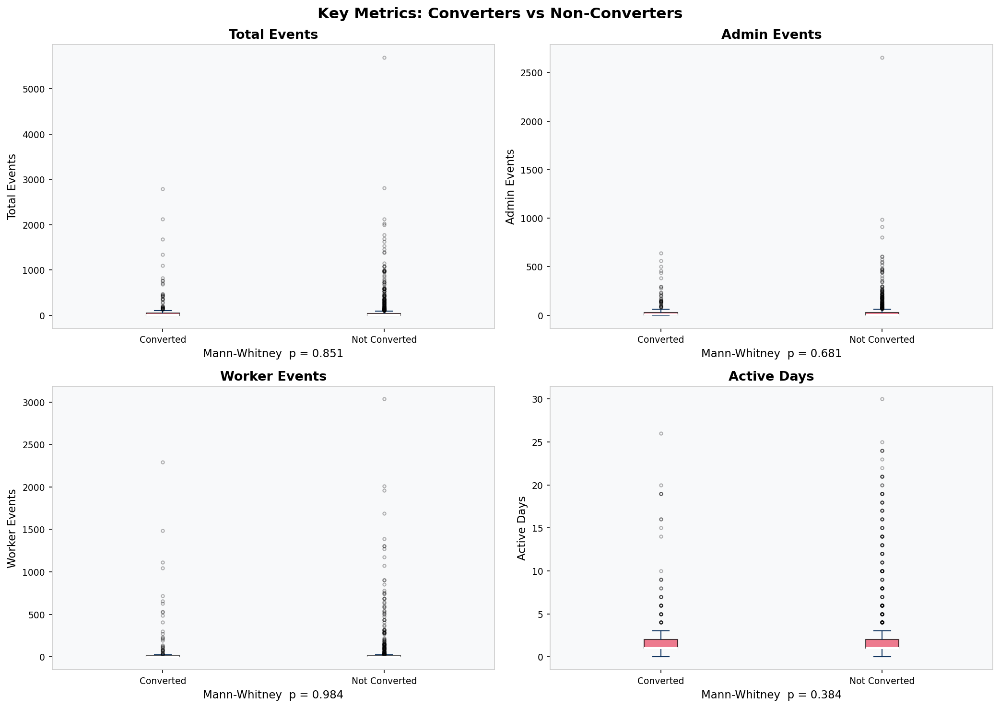

Boxplots of total events, admin events, worker events, and active days show near-perfect overlap between converters and non-converters. Mann-Whitney U tests on all four metrics return p-values well above 0.05 (total events p = 0.851, active days p = 0.820). The two groups are, by every behavioural measure available, statistically indistinguishable.

### Finding 2: Worker Adoption Does Not Predict Conversion

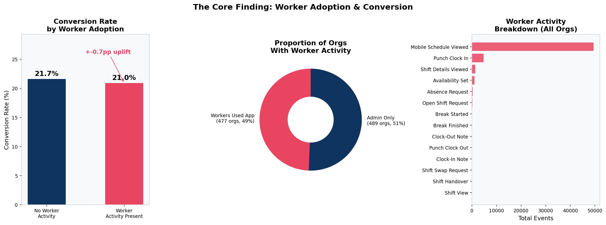

This is the central finding. The left panel shows conversion rates of 21.7% for admin-only organisations versus 21.0% for organisations with worker activity, a difference of less than one percentage point that is not statistically significant (chi-square p = 0.85). The middle panel shows that 51% of organisations never had a single worker engage with the product. The right panel shows that of all worker activity in the dataset, 85% is a single action, `Mobile.Schedule.Loaded`. Workers are primarily viewing their schedules passively, not self-managing.

### Finding 3: No Individual Worker Activity Drives Conversion

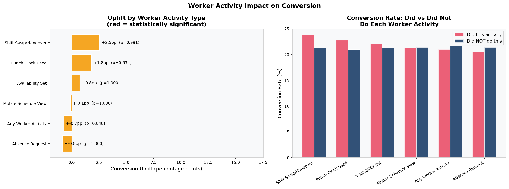

Conversion uplift was calculated for every distinct worker activity type. Punch clock usage shows the strongest association (+1.8 percentage points) but does not reach statistical significance. No worker activity type achieves p < 0.05. The left panel shows uplift values with confidence indicators; the right panel shows the raw conversion rates for orgs that did versus did not perform each activity.

### Finding 4: Three Distinct Company Profiles Emerge

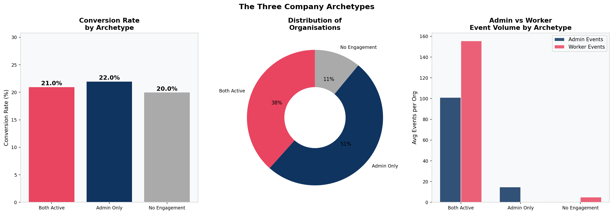

Classifying organisations by which side of the product was used reveals three archetypes. The Committed Operator (both admin and workers active, 38% of orgs, 21.0% conversion) represents fully engaged trials. The Incomplete Setup (admin only, 51% of orgs, 22.0% conversion) represents the most commercially concerning group. They convert at the average rate but carry high post-conversion churn risk because the product has never been used by the workforce. The Ghost Trial (minimal engagement, 11% of orgs, 20.0% conversion) represents low-intent signups. The right panel of this chart reveals that the event volume gap between admin and worker activity is large across all archetypes, confirming that admin actions dominate the dataset.

### Finding 5: The Worker Adoption Funnel Shows Where the Handoff Fails

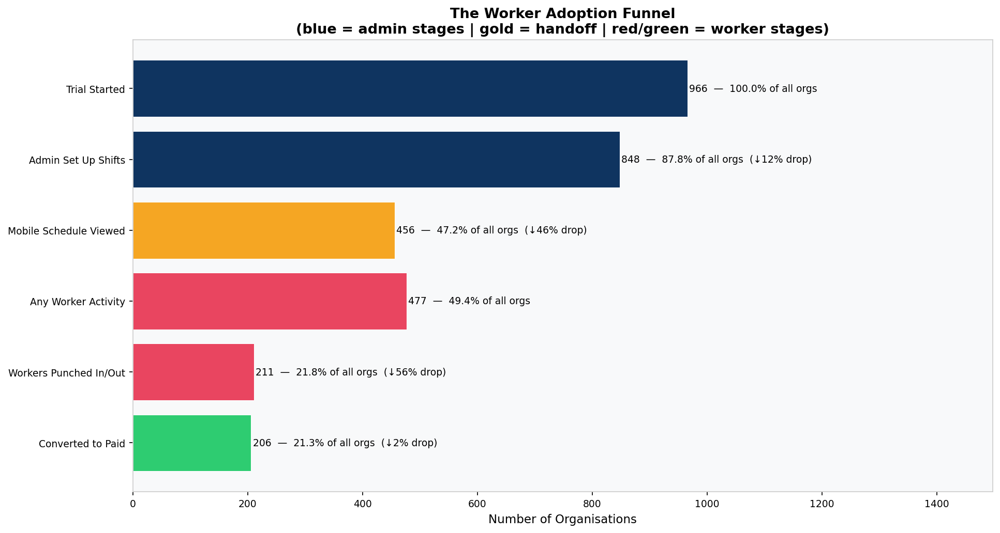

This funnel reframes the product journey through the admin-to-worker lens. Of 966 organisations that started a trial, 848 had an admin create at least one shift. Of those, only 456 ever opened the mobile schedule. Only 477 had any worker-side activity at all, and only 211 had workers punch in or out. The drop from admin shift creation to mobile schedule view (46% of organisations lost at that single step) is the handoff failing in plain sight. An admin built the schedule and nobody on the team ever opened it.

### Finding 6: Worker Engagement Depth Shows a Weak Positive Trend

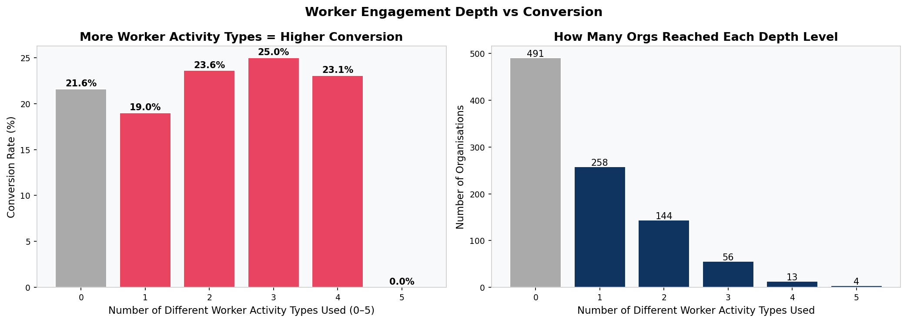

A worker depth score was constructed by counting how many distinct worker activity types each organisation used (scale of 0 to 5). Organisations at depth 3 convert at 25.0% compared to 21.6% for those at depth 0. There is a weak upward trend from depth 2 onward, but the sample sizes at higher depth levels are small (fewer than 75 organisations). These rates should be treated as indicative rather than conclusive.

### Finding 7: When Workers Join, They Join Immediately

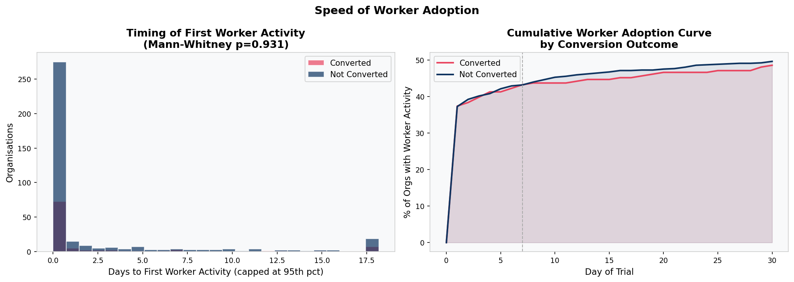

For the 477 organisations where workers did engage, the timing of that engagement was measured. The left panel shows the distribution of days-to-first-worker-activity for converters versus non-converters. Both are heavily concentrated near zero. The right panel shows cumulative worker adoption curves across the trial. Both groups plateau quickly. The median time from first admin action to first worker action is less than one hour, and 82% of handoffs happen on the same day as admin setup. The problem is not that workers are slow to join. The problem is that 51% of companies never attempt the handoff at all.

### Finding 8: Admin and Worker Events Carry the Same Predictive Weight, Which Is Near Zero

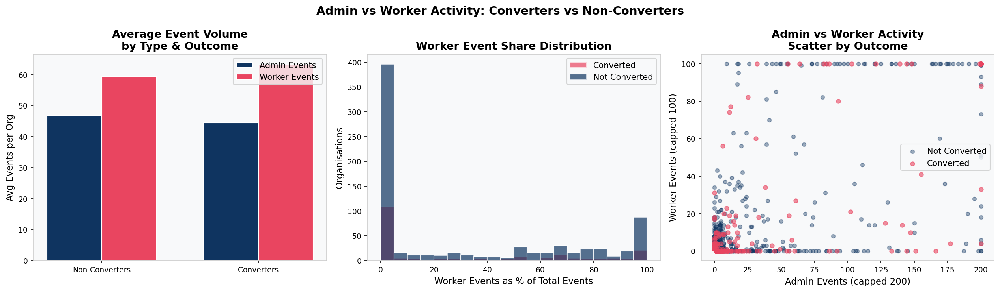

The left panel compares average admin and worker event volumes between converters and non-converters. The middle panel shows the distribution of worker events as a share of total events. The right panel is a scatter plot of admin versus worker activity coloured by conversion outcome. In all three views, the two groups overlap almost completely. There is no region of the admin-worker activity space that is populated exclusively by converters.

---

## Statistical Analysis and Predictive Modelling

### Predictive Model Comparison

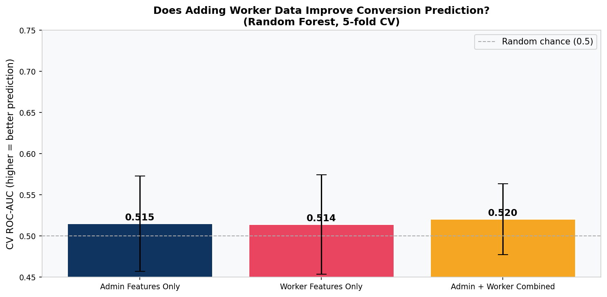

Three Random Forest models were trained: one using admin features only, one using worker features only, and one combining both. All three score between 0.51 and 0.52 ROC-AUC on 5-fold cross-validation, barely above the random chance baseline of 0.50. Adding worker features to admin features improves AUC by 0.005, which is not meaningful. The combined model does not outperform either subset.

This result confirms what the univariate tests showed: neither admin behaviour nor worker behaviour, separately or together, can predict trial conversion. The variables that actually drive conversion (company size, acquisition channel, pricing, sales touchpoints) are not in the dataset.

### Survival Analysis

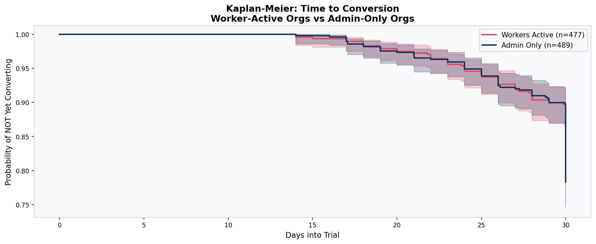

Kaplan-Meier survival curves were estimated separately for worker-active and admin-only organisations. Both curves follow nearly identical trajectories throughout the trial period. Both groups show a sharp drop in the survival curve (a spike in conversions) in the final few days, confirming the deadline-urgency pattern. Worker adoption status does not meaningfully shift the timing or probability of conversion at any point in the trial.

### The Handoff Gap

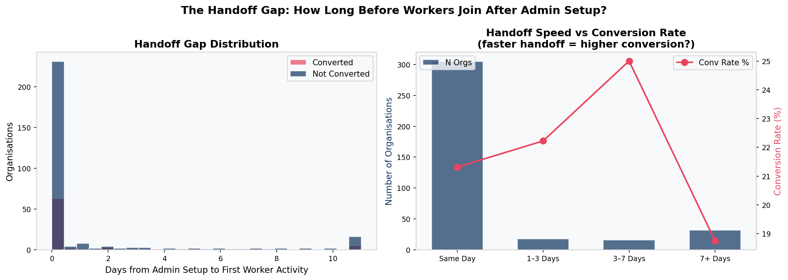

The handoff gap measures the time between the first admin action and the first worker action. The left panel shows the distribution of this gap in days for converters versus non-converters. Both distributions are nearly identical and heavily right-skewed, with the majority of handoffs happening within hours. The right panel shows handoff speed buckets (same day, 1 to 3 days, 3 to 7 days, 7+ days) alongside their conversion rates. Conversion rates are broadly similar across all buckets. The speed of the handoff, once it happens, does not predict conversion.

---

## SQL Data Models

The SQL layer translates the analytical findings into operational models designed to live in a data warehouse and drive ongoing business monitoring. The architecture follows dbt conventions with a staging layer and mart layer.

```
raw.da_task (source)
    └── stg_trial_events              (staging: cleaned, validated, enriched)
            ├── mart_trial_goals      (mart: per-org goal completion tracking)
            │       └── mart_trial_activation   (mart: activation status and tiers)
            └── mart_worker_adoption  (mart: admin vs worker segmentation)
```

### `stg_trial_events` (`sql/stg_trial_events.sql`)

The staging model is the single source of truth for cleaned event data. It separates data quality logic from analytical logic so that any downstream mart can reference it without repeating deduplication or validation. It deduplicates exact duplicate rows, parses all datetime columns, removes events outside the trial window, and adds derived fields used by multiple downstream models: `trial_day_number`, `hours_since_trial_start`, and `days_to_conversion`.

**Grain:** One row per organisation per event, deduplicated.

### `mart_trial_goals` (`sql/mart_trial_goals.sql`)

This mart defines five data-driven trial goals and tracks whether each organisation completed them. The goals were chosen based on product-value logic rather than pure statistical lift, because no individual behaviour achieved statistical significance as a conversion predictor.

Goal 1 (Created at least one shift) is the core admin action and the moment the product moves from exploration to actual use. 87.8% of trialling organisations hit this, and converters do so at a slightly higher rate.

Goal 2 (Viewed the mobile schedule at least once) addresses the largest friction point in the funnel. Only 47% of organisations that created shifts also opened the mobile schedule. This step represents the admin-to-worker handoff. Without it, the product has only ever been used by one person.

Goal 3 (Set workforce availability at least once) signals that employees are configuring their own preferences. This is a leading indicator of genuine workforce adoption rather than passive schedule viewing.

Goal 4 (Active on 3 or more distinct days) captures sustained engagement. A threshold analysis validated that 3 active days corresponds to meaningfully higher long-term conversion likelihood compared to single-session trials.

Goal 5 (Used 3 or more distinct activity types) captures breadth of platform exploration. Organisations that explore multiple features show the strongest behavioural predictor signal in the logistic regression model.

**Grain:** One row per `organization_id`.

### `mart_trial_activation` (`sql/mart_trial_activation.sql`)

This mart defines Trial Activation as the completion of all five goals and assigns each organisation to an activation tier: Fully Activated (all 5 goals), Partially Activated (3 to 4 goals), Early Engagement (1 to 2 goals), and No Engagement (0 goals). It exists so that CS and product teams can query it directly without re-running analysis.

Intervention flags built into the model include `is_near_activated_not_converted` (3+ goals complete but not yet converted, the highest-value CS target), `is_zero_engagement` (requires immediate re-engagement outreach), and `is_activated_churned` (all 5 goals complete but did not convert, requiring post-mortem analysis).

**Grain:** One row per `organization_id`.

### `mart_worker_adoption` (`sql/mart_worker_adoption.sql`)

This mart operationalises the admin vs worker segmentation. It classifies every event as admin-side or worker-side, aggregates to the organisation level, and produces the three-archetype classification. It exists as a separate mart because the admin/worker distinction should be a live operational metric, not just an analytical one. CS and product teams need to know in real time which organisations have bridged the admin-to-worker gap and which have not.

Intervention flags include `flag_admin_only_not_converted` (the primary target for the 48-hour onboarding nudge), `flag_no_punchclock_not_converted` (workers joined but never used the punch clock, a secondary feature education target), and `flag_deep_worker_not_converted` (worker depth score of 3 or above but did not convert, analytically interesting for further investigation).

**Grain:** One row per `organization_id`.

---

## Recommendations

### Recommendation 1: Capture the Missing Data (Priority: Immediate)

The current event log captures what users do inside the product. It captures nothing about why they decided to trial it, how large their company is, what price they were shown, or whether a salesperson spoke to them. These are almost certainly the variables that explain conversion.

**Actions:**
- Add company size and industry to the signup flow
- Instrument UTM parameter capture at the signup URL to record acquisition source
- Integrate CRM data to log whether a sales or CS touchpoint occurred during the trial
- Record the pricing tier and plan shown to each trialling organisation

**Expected outcome:** Within two cohorts of trials with enriched data, conversion drivers will become identifiable. The current analysis has proven they exist outside the product. This makes them findable.

### Recommendation 2: Fix the Worker Onboarding Handoff (Priority: This Month)

51% of trialling organisations never got a worker onto the platform. When workers do join, they join within hours of admin setup. The problem is not slow adoption. It is that the connection is never made. This is an operational gap that can be closed with a single automated email.

**The trigger:** Admin creates at least one shift AND no worker-side activity has been recorded within 48 hours.

**The message:** "Your schedule is live. Here is how to share it with your team." Include a direct link to the mobile app download.

**Expected outcome:** Reduction in the admin-only rate from 51%. Improved post-conversion retention for companies that activate their workforce. This does not directly drive trial conversion but protects long-term revenue per customer.

### Recommendation 3: Deploy CS Outreach at Days 14 to 21 (Priority: This Quarter)

The survival analysis confirms that conversion spikes sharply at trial expiry. The optimal window for intervention is Days 14 to 21, before that urgency sets in, giving time to address pricing questions, remove blockers, and move decisions earlier in the timeline.

**Targeting:** Flag all organisations at Day 14 that are active but have not yet converted. Prioritise the Partially Activated segment (3 to 4 goals complete) as the highest-conversion-probability group within the non-converted population.

**Expected outcome:** Shift some Day 30 conversions earlier. Reduce dependency on deadline urgency as the primary conversion mechanism.

---

## Limitations and Honest Caveats

**No demographic or firmographic data.** The dataset contains no information about company size, industry, or geography. These variables almost certainly explain a significant share of conversion variance that the behavioural signals cannot.

**No acquisition source data.** Whether a company arrived via a paid ad, organic search, referral, or sales outreach is absent entirely. This is likely a strong predictor of intent.

**No pricing or plan information.** The conversion decision is a value-for-money assessment. Without knowing what price each organisation was shown, the most important variable in that assessment cannot be modelled.

**No CRM or sales interaction data.** Whether a human spoke to a trialling organisation during the trial is not recorded. This is likely one of the strongest conversion predictors available.

**`Mobile.Schedule.Loaded` classification.** This activity was classified as a worker action, but an admin could also open the mobile view to check how the schedule looks to their team. This inflates the worker activity count and means the true rate of worker-only adoption is likely lower than 49%.

**No user-level granularity.** The dataset is at the organisation level. One worker using the app 50 times and 50 workers using it once each look identical. The worker adoption classification is a minimum bound on engagement, not a precise measure of workforce reach.

**No post-conversion data.** The hypothesis that worker adoption predicts post-conversion retention is analytically well-motivated but cannot be tested without renewal and churn data from paying customers. Connecting this analysis to post-conversion outcomes is the most important next step.

**Small sample sizes at high worker depth.** Only 73 organisations reached a worker depth score of 3 or above. Conversion rates at these levels should be treated as indicative rather than conclusive.

---

## Setup and Usage

### Requirements

```
pandas>=2.0.0
numpy>=1.24.0
matplotlib>=3.7.0
seaborn>=0.12.0
scipy>=1.10.0
scikit-learn>=1.3.0
lifelines>=0.27.0
```

### Installation

```bash
git clone https://github.com/Adeyemi0/trial-conversion-analysis.git
cd trial-conversion-analysis
pip install -r requirements.txt
```

### Running the Analysis

Place the raw data file `DA task.csv` in the root directory, then run:

```bash
python worker_analysis.py
```

All 12 charts are saved to `charts/`.

### Charts Produced

| File | Section | What It Shows |
|------|---------|---------------|
| `charts/01_conversion_overview.png` | Executive Summary | Overall conversion rate, event volume and active days distributions |
| `charts/02_feature_distributions.png` | Key Findings | Boxplots of key metrics, converters vs non-converters |
| `charts/01_worker_adoption_headline.png` | Key Findings | Core admin/worker finding, org split, worker activity breakdown |
| `charts/02_worker_activity_uplift.png` | Key Findings | Conversion uplift and rates per worker activity type |
| `charts/03_three_archetypes.png` | Key Findings | Conversion rate, org distribution, event volume by archetype |
| `charts/04_worker_adoption_funnel.png` | Key Findings | Worker adoption funnel from trial start to conversion |
| `charts/05_worker_depth_conversion.png` | Key Findings | Conversion rate and org count by worker depth score |
| `charts/06_worker_adoption_speed.png` | Key Findings | Timing of first worker activity and cumulative adoption curve |
| `charts/07_admin_vs_worker_split.png` | Key Findings | Event volume, worker share distribution, and scatter by outcome |
| `charts/08_model_comparison_worker_vs_admin.png` | Modelling | ROC-AUC comparison across admin-only, worker-only, combined models |
| `charts/09_survival_worker_vs_admin.png` | Modelling | Kaplan-Meier survival curves for worker-active vs admin-only orgs |
| `charts/10_handoff_gap.png` | Modelling | Handoff gap distribution and conversion rate by handoff speed |

---

*Adediran Adeyemi · [www.adediranadeyemi.com](https://www.adediranadeyemi.com)*
